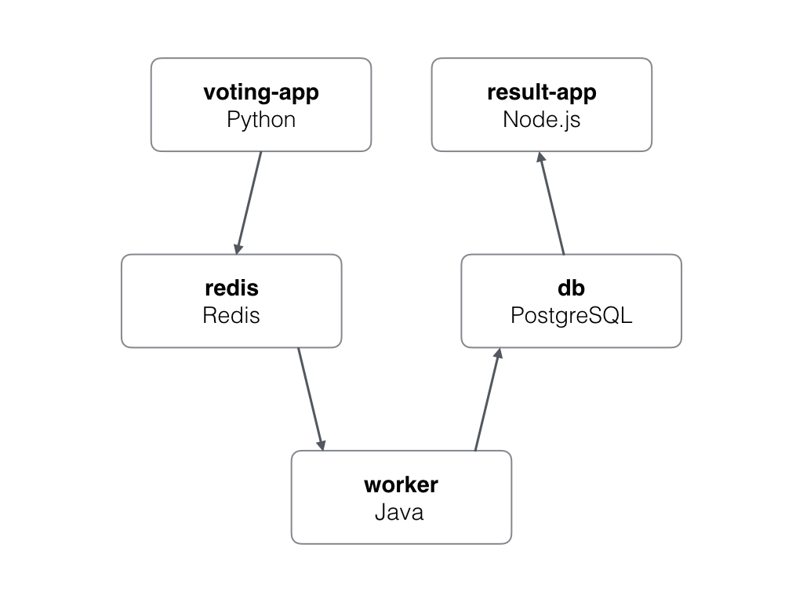

Ma Fleur - Ma Valise, based on Example Voting App
=========

A simple distributed application running across multiple Docker containers.

This application is based on the voting app but with small differencies.
We do not want to have statistics but we want to assess the mood of every team
member.

If a team member is feeling ok, then he votes for a flower ("Ma Fleur") which
represents something light. 

If a team member is feeling so so, then he votes for a luggage ("Ma Valise")
which represents something heavy.

Then every team member can check the results, to assess the mood of the others
and then know how to speak to them.

Run the app in Kubernetes
-------------------------

The folder k8s-specifications contains the yaml specifications of the Voting App's services.

First create the vote namespace

```
$ kubectl create namespace vote
```

Run the following command to create the deployments and services objects:
```
$ kubectl create -f k8s-specifications/
deployment "db" created
service "db" created
deployment "redis" created
service "redis" created
deployment "result" created
service "result" created
deployment "vote" created
service "vote" created
deployment "worker" created
```

The vote interface is then available on port 31000 on each host of the cluster, the result one is available on port 31001.

Architecture
-----



* A front-end web app in [Python](/vote) with [Flask] which lets you vote between two options
* A [Redis](https://hub.docker.com/_/redis/) queue which collects new votes
* A [Java](/worker/src/main) worker which consumes votes and stores them in…
* A [Postgres](https://hub.docker.com/_/postgres/) database backed by a Docker volume
* A [Node.js](/result) webapp which shows the results of the voting in real time


Note
----

The voting application only accepts one vote per client. It does not register votes if a vote has already been submitted from a client.
