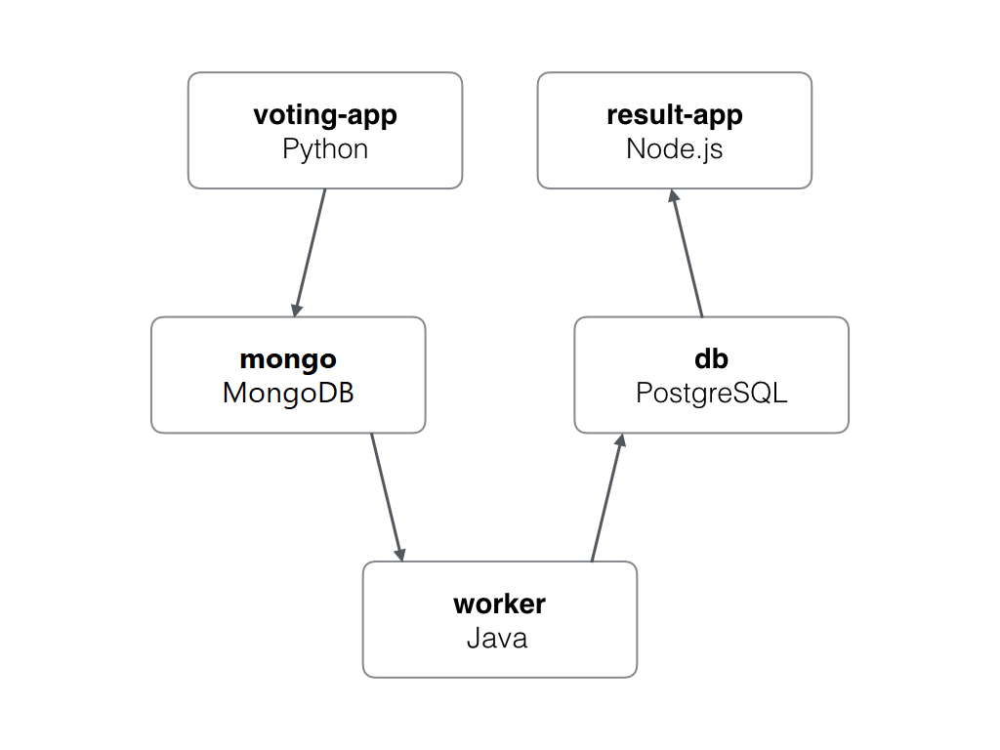

Ma Fleur - Ma Valise, basé sur l'exemple Voting App
=========

Référence : [Voting App](https://github.com/dockersamples/example-voting-app)

Une application distribuée simple qui utilise des conteneurs.

Cette application est basée sur la voting app de Bret Fisher, mais avec
quelques différences.
On ne veut pas ici avoir des statistiques mais évaluer l'humeur de chaque
membre de l'équipe.

Si un membre se sent bien, il vote pour une fleur, qui représente quelque chose
de léger.

Si un membre se sent bof, il vote pour la valise, qui représente quelque chose
de pesant.

Chaque membre de l'équipe peut alors voir les résultats, évaluer les humeurs
des autres et ajuster sa manière de parler, de se comporter.

Lancer l'application dans Kubernetes
-------------------------

Le répertoire k8s-specifications contient les fichiers yaml de specifications.

Créer d'abord le namespace `vote`.

```bash
$ kubectl create namespace vote
```

Run the following command to create the deployments and services objects:
```bash
$ kubectl create -f k8s-specifications/deploiement-total.yaml
deployment "db" created
service "db" created
deployment "mongo" created
service "mongo" created
deployment "result" created
service "result" created
deployment "vote" created
service "vote" created
deployment "worker" created
```

L'interface du vote est disponible sur le port 31000 sur chaque noeud du
cluster, et celle du résultat sur le port 31001.

Architecture
-----



* Une application web front-end en [Python](https://hub.docker.com/_/python)
  avec `Flask` qui permet de saisir son nom et de choisir fleur ou valise.
* Une file [MongoDB](https://hub.docker.com/_/mongo) qui collecte les votes.
* Un worker [Java](/worker/src/main) qui consomme les votes et les stocker
  dans...
* Une base de données [PostgresSQL](https://hub.docker.com/_/postgres/) 
* Une webapp [Node.js](/result) qui montre les résultats des votes en temps
  réel.
